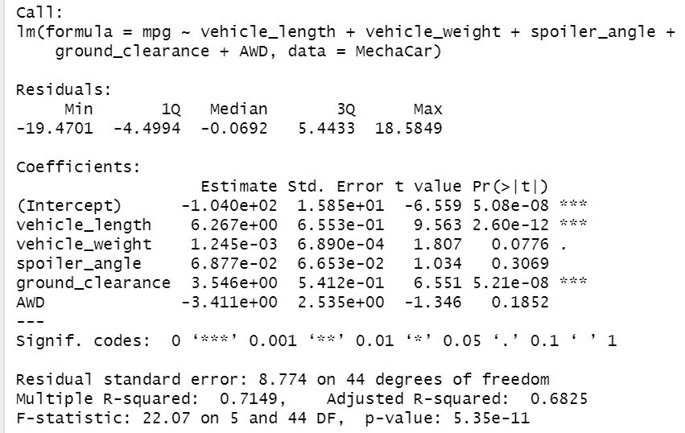
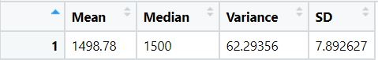
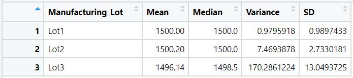
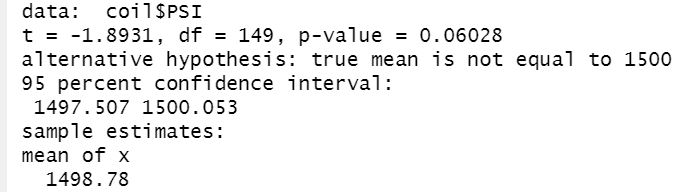
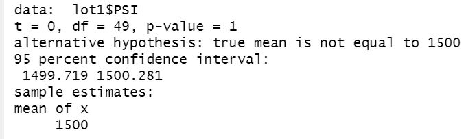
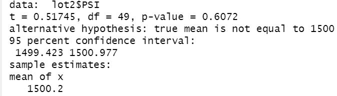
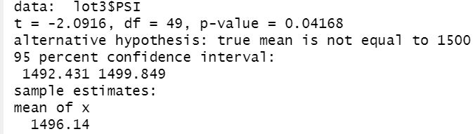

# Statistic Analysis with R

## Linear Regression to Predict MPG
Using linear regression, we analyized how various metrics may affect the MPG of MechaCars.  From below summary table, we can conclude the following:

* Of the five metrics we analyized, Vehicle Lenght and Ground Clearance show statistically significant correlation to MPG with their P values below 0.05.  On the other hand, Spoiler Angle and AWD do not show clear correlation to MPG.  Vehicle Weight may have relationship with a P value slightly above 0.05.  More sampling could give us better understanding on this factor.

* The slope of the linear model is non-zero with three of the five metrics showing correlation to MPG. 

* With a R-squared value of 0.7, this model do a good job predicting the MPG of MechaCars.  

**Summary Linear Regression of Multiple Metrics** 

## Summary Statistics on Suspension Coils
In this analysis, we evalute three lots of coils to see if they meet the design specification of 1,500 PSI with the variance of not exceeding 100 PSI.  Although the combined lot "pass" on the quality requirements, looking at individual lot, we can see lot 3 "fail" in quality with variance of 170 PSI, well above the 100 PSI target and mean PSI below the 1,500 PSI specification.

**PSI Quality of Combined three lots** 

**PSI quality of individual lot** 

## T-Tests on Suspension Coils

**Combined Lot T-Test** 

**Lot 1 T-Test** 

**Lot 2 T-Test** 

**Lot 3 T-Test** 

## Study Desing: MechaCar vs Competition
We believe price and safety rating are two key factors consumers use in their auto purchase decision.

To analyize the competitiveness of MechaCar in the market place, we will need to collect data of price, and safety rating of comparable products.

We can use Regression analysis to test the relationship between Price and Safety Rating with the null hypothesis of price has not relationship to safety rating .  

Base on the P-value we can first determine if we can reject the null hypothesis and concludes that there is a relationship between price and safety rating.  If that is the case, we will be able to obtain the slope and intercept f

We can then further examine MechaCar's price and safety rating 

